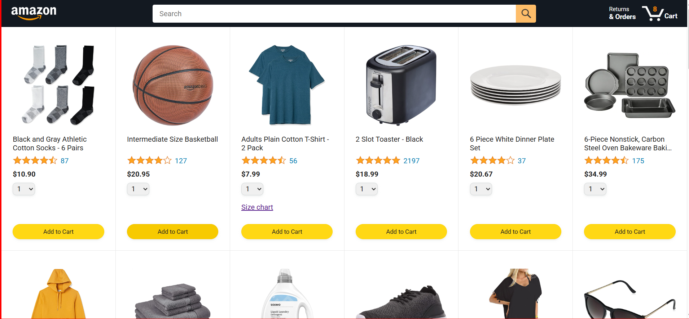
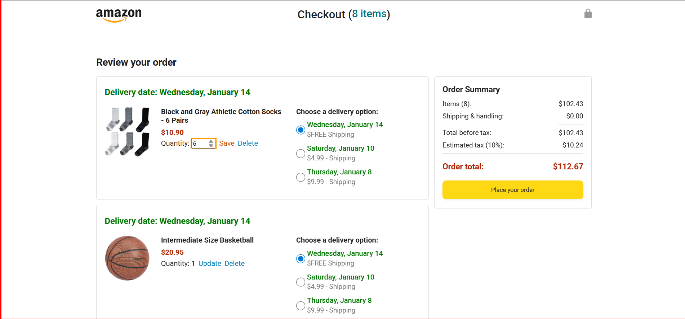
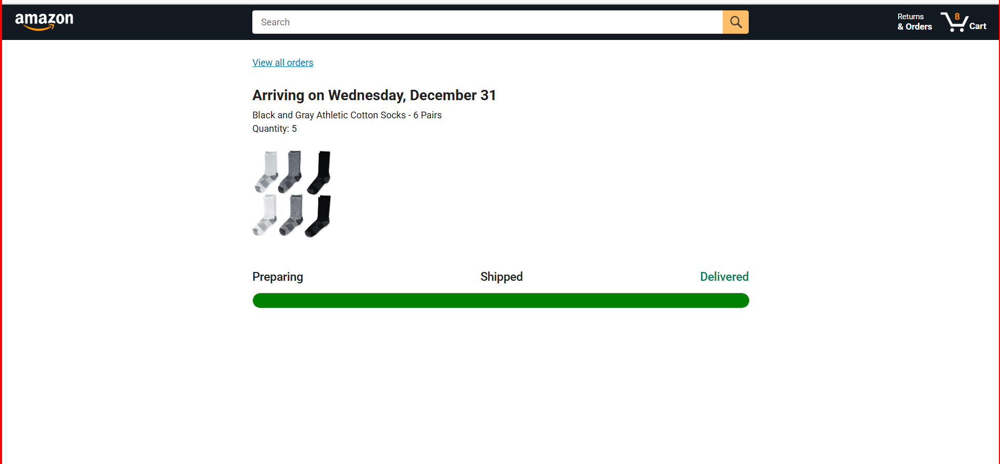

# 🛒 Ecommerce Frontend (Vanilla JavaScript)

An Amazon‑like e‑commerce frontend built from scratch using **vanilla JavaScript, HTML, and CSS** — no frameworks.  
Implements core e‑commerce functionality including product listing, cart management, checkout flow, order history, and tracking.

---

## ✨ Features
- Dynamic product browsing & product details
- Cart functionality with quantities and delivery options
- Checkout page with order summary and payment breakdown
- Order storage and tracking page
- Persistent cart using `localStorage`
- ES Modules + clean frontend architecture
- Fully tested with Jasmine test suites (unit & integration)

---

## 📂 Project Structure
```
.
├── amazon.html           # Main product listing page
├── checkout.html         # Checkout page
├── orders.html           # Orders history page
├── tracking.html         # Order tracking page
├── scripts/
│   ├── checkout.js
│   ├── header.js
│   └── …
├── data/                 # Business logic + models (cart, products, delivery, orders)
├── styles/               # CSS modules
├── tests/                # Jasmine test suites
└── images/               # Static assets
```

---

## 🚀 Getting Started

### Run the App
Clone the repo:
```bash
git clone https://github.com/Akash-Jadon-7895/ecommerce-frontend-vanilla-js.git
cd ecommerce-frontend-vanilla-js
```

Open any page in your browser:
```bash
open amazon.html
open checkout.html
```

Or serve with a static server (recommended for routing):
```bash
npx http-server -c-1 .
```
Then visit: `http://localhost:8080/amazon.html`

---

## 🧪 Tests

This project includes automated tests using **Jasmine**.

Run tests by opening:
```
tests/tests.html
```

Test coverage:
- Unit tests for cart, delivery options, products
- DOM rendering tests (order summary, payment summary)
- Note: Some test cases for certain components or pages are currently missing. They may be added in the future to improve coverage.

---

## 💡 Tech & Tools
- JavaScript (ES Modules)
- HTML5 & CSS
- Jasmine for automated browser tests
- localStorage for cart & orders persistence

---

## ⭐ Highlights / What You’ll Learn
- Product data modeling and transformation
- Modular JavaScript architecture
- Shopping cart logic with add/remove/update features
- Asynchronous data loading with `fetch`
- DOM rendering & event handling
- Testing frontend logic and rendering with Jasmine

---

## 🏆 Example Screenshots

<p align="center">
  
  
</p>

<p align="center">
  
  
</p>

---

## 📌 Notes
- This is a **frontend only** project — no backend server is included.
- Product data is fetched from a demo backend via CORS (where available).
- Tests are browser‑run via Jasmine (no Jest or Node environment).

---

## 🙌 Credits
Built with ❤️ by **Akash Jadon**

---

## ⚖️ License
This project is open‑source and available under the **MIT License**.
```
